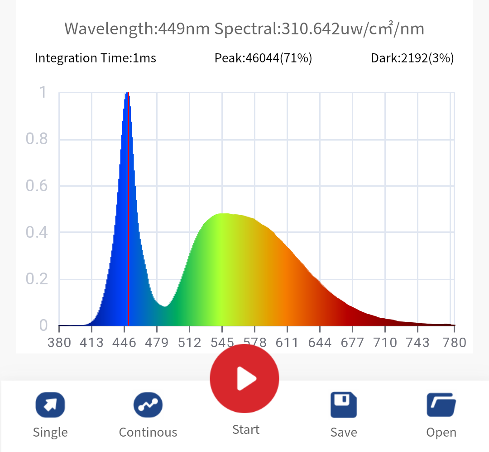
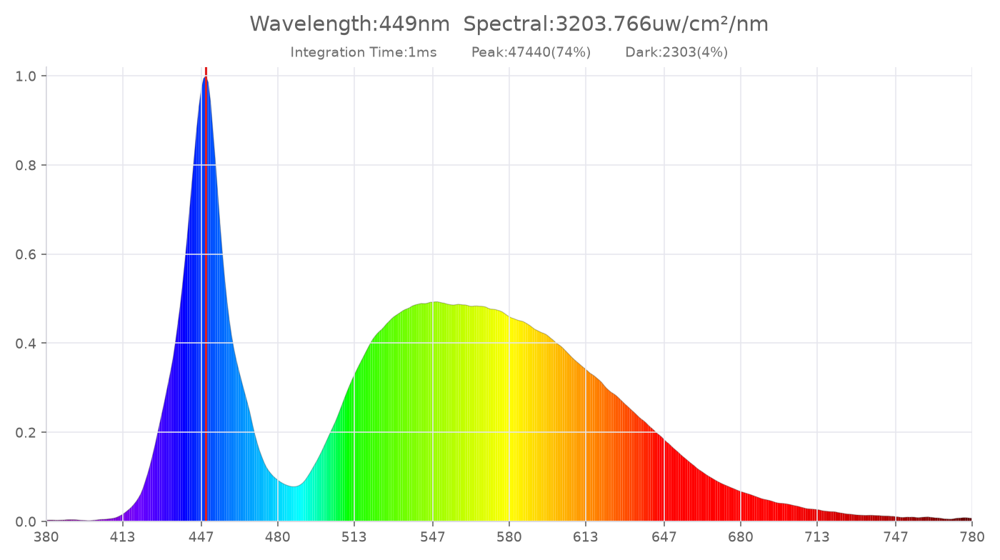

# hpcs310-ble

Read spectra from **HopooColor HPCS-310 / HPCS-330** spectrometers over
Bluetooth LE, no app required.

One measurement gives you a self-contained folder with the spectrum as CSV,
all device metrics as JSON, an app-style PNG plot, and the raw frame.

> The BLE protocol was reverse-engineered from the official HopooColor Android
> app.

## Matches the official app

Same lamp, captured seconds apart. Small differences are drift between the two
captures.

| Official app | This tool |
| --- | --- |
|  |  |

## Requirements

- Python ≥ 3.9 and a Bluetooth LE adapter (Linux, macOS, Windows)

## Install & run

With [uv](https://docs.astral.sh/uv/) nothing needs installing: dependencies
are declared inline and fetched automatically:

```bash
uv run hpcs310.py scan
```

With plain Python, install the dependencies first:

```bash
python3 -m pip install bleak matplotlib numpy
python3 hpcs310.py scan
```

(`matplotlib`/`numpy` are only needed for the PNG plot; without them the tool
still works and just skips `spectrum.png`.)

## Usage

```bash
uv run hpcs310.py scan                       # list nearby HPCS* devices
uv run hpcs310.py measure                    # measure -> auto folder device_SN_timestamp/
uv run hpcs310.py measure --address AA:BB:CC:DD:EE:FF --out run1
uv run hpcs310.py measure --confirm          # connect, wait for Enter, then measure
uv run hpcs310.py measure --no-plot          # skip the PNG
uv run hpcs310.py flicker --address AA:BB:CC:DD:EE:FF --out flicker-run
uv run hpcs310.py flicker --auto --continuous # Auto rate; FW >= 2007 required
uv run hpcs006_gain.py --address AA:BB:CC:DD:EE:FF --out hpcs006-run
uv run hpcs310.py decode frame.bin --csv spec.csv   # re-decode a saved raw frame
uv run hpcs310.py selftest                   # verify the decoder, no hardware needed
```

## Flicker work

The HPCS-005 adaptive `flicker` command begins with Auto gain, examines both
the fixed 400-point `8C3A` waveform and `8C3C` metrics, then safely tries
manual ×10, ×100, and ×1000 only when the waveform is viable and has estimated
headroom. It checkpoints raw `8C3A`/`8C3C` responses, all waveform samples,
configuration readbacks, diagnostics, and every accept/reject/retry decision.

`hpcs006_gain.py` is a separate HPCS-006 characterisation runner. It records
manual ×1/×10/×100/×1000 at index 07 (20 kHz, 500 ms) without changing the
HPCS-005 acceptance policy. See [the flicker protocol and experiment record](docs/hpcs-flicker.md)
for the validated behavior and current limitations.

`measure` connects to the first `HPCS*` device it finds (or `--address`),
triggers one measurement, and writes a folder named
`<device>_<SN>_<YYYYMMDD-HHMMSS>/` (or `--out DIR`):

| file | contents |
|------|----------|
| `spectrum.csv` | `wavelength_nm,intensity_uW_cm2_nm`, 1 nm steps |
| `measurement.json` | device info, integration time, peak, full spectrum, and every metric the device reports (Lx, CCT, x/y, Ra, R1–R15, PAR, …) |
| `spectrum.png` | plot styled like the app's "Spec." chart |
| `frame.bin` | raw BLE result frame, for offline `decode` |

Add `-v` to any command to log every BLE frame in hex.

## Troubleshooting

- **No device found**: make sure the spectrometer is on and not currently
  connected to the phone app (it accepts one connection at a time).

## Supported devices

Tested with the HPCS-310. All HPCS-310/330 variants (P/PAR, UV, IR, PR, C)
use the same protocol and are decoded with their model-specific metric sets;
reports welcome.

## License

MIT
